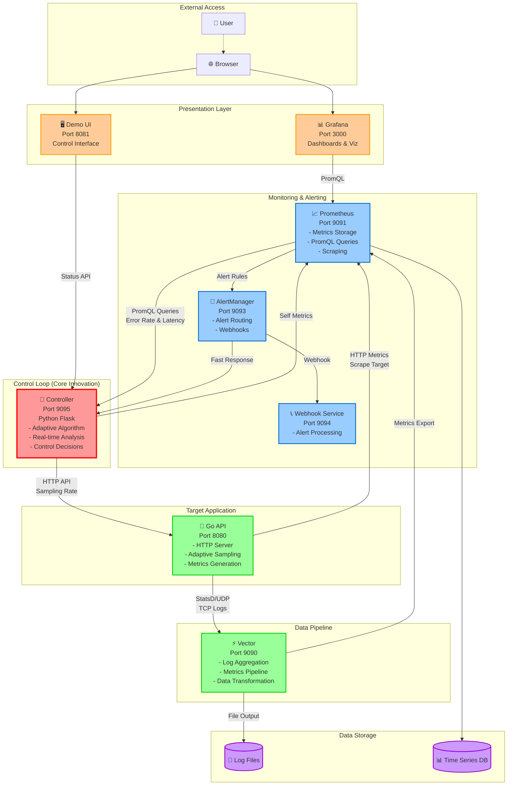

# 🚀 Self-Adaptive Observability Platform

[](https://opensource.org/licenses/MIT)
[](https://www.docker.com/)
[](https://prometheus.io/)
[](https://golang.org/)
[](https://www.python.org/)

> **Intelligent observability platform that automatically adjusts data collection rates based on real-time system conditions, reducing costs by 60-90% while maintaining incident detection capability.**

## 🎯 **Problem Statement**

Traditional observability systems face a critical dilemma:
- **Static sampling**: Wastes money collecting unused data during normal operations
- **High sampling**: Expensive but ensures incident visibility
- **Low sampling**: Cost-effective but risks missing critical events
- **Manual tuning**: Time-intensive and reactive, not predictive

**Result**: Organizations spend millions on observability data they never use, while missing the 20% that matters during incidents.

## 💡 **The Solution**

The **Self-Adaptive Observability Platform** implements a **closed-loop control system** that automatically adjusts data sampling rates based on real-time system health metrics.

### **Core Innovation: Control Theory Applied to Observability**

```
┌─────────────┐    ┌──────────────┐    ┌─────────────────┐
│   SENSOR    │───▶│ CONTROLLER   │───▶│   ACTUATOR      │
│(Prometheus) │    │(Python App)  │    │(Sampling Rate)  │
└─────────────┘    └──────────────┘    └─────────────────┘
       ▲                                        │
       │            ┌──────────────┐           │
       └────────────│    PLANT     │◀──────────┘
                    │  (Go API)    │
                    └──────────────┘
```

**Adaptive Logic:**
- 🔴 **High errors OR high latency** → Increase sampling (more visibility)
- 🟢 **Low errors AND low latency** → Decrease sampling (cost optimization)
- ⏱️ **Real-time response** → 3-second polling + instant webhook reactions
- 🛡️ **Stability controls** → Cooldown periods prevent oscillation

## 🏗️ **Architecture Overview**

### **System Components**

| Service | Technology | Purpose | Port | Key Features |
|---------|------------|---------|------|--------------|
| **Controller** | Python/Flask | Decision engine with control algorithms | 9095 | Real-time metrics analysis, adaptive control logic |
| **Go API** | Go/HTTP | Target application with adaptive sampling | 8080 | StatsD/TCP logging, sampling rate control |
| **Vector** | Rust | High-performance data pipeline | 9090 | Log aggregation, metrics forwarding |
| **Prometheus** | Go | Time-series database and query engine | 9091 | Metrics storage, PromQL queries |
| **AlertManager** | Go | Alert routing and webhook delivery | 9093 | Critical event notifications |
| **Grafana** | TypeScript | Visualization and dashboards | 3000 | Real-time monitoring, custom dashboards |
| **Demo UI** | Python/Flask | Real-time monitoring interface | 8081 | System status, manual controls |
| **Webhook** | Python/Flask | AlertManager webhook receiver | 9094 | Alert processing and logging |

### **Detailed Architecture Schema**



### **Control System Flow**

```
┌─────────────────┐    Sensor     ┌─────────────────┐
│   PROMETHEUS    │───────────────▶│   CONTROLLER    │
│  (Metrics DB)   │   PromQL       │ (Decision Logic)│
└─────────────────┘   Queries      └─────────────────┘
         ▲                                    │
         │                                    │ Actuator
         │ Scrape                            │ HTTP API
         │ /metrics                          ▼
┌─────────────────┐                ┌─────────────────┐
│     GO API      │◀───────────────│   SAMPLING      │
│   (Plant)       │  Rate Control  │    CONTROL      │
│                 │                │   (/control/)   │
└─────────────────┘                └─────────────────┘
         │
         │ Telemetry
         ▼ (StatsD, Logs)
┌─────────────────┐
│     VECTOR      │
│ (Data Pipeline) │
└─────────────────┘
```
