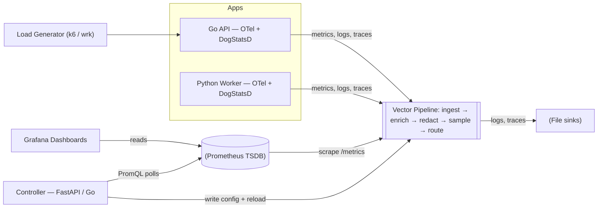

# Self-Adaptive-Observability-Platform-
Real-time anomaly-triggered telemetry control for cost optimization and debugging efficiency.

# Architecture 

## Architecture Diagram

```mermaid
flowchart LR
  subgraph Apps
    API["Go API — OTel + DogStatsD"]
    Worker["Python Worker — OTel + DogStatsD"]
  end

  LoadGen["Load Generator (k6 / wrk)"] --> API

  API -->|metrics, logs, traces| Vector
  Worker -->|metrics, logs, traces| Vector

  Vector[["Vector Pipeline: ingest → enrich → redact → sample → route"]]

  %% Prometheus pulls (/metrics) from Vector
  Prometheus[("(Prometheus TSDB)")] -->|scrape /metrics| Vector

  %% Grafana pulls (queries) from Prometheus
  Grafana["Grafana Dashboards"] -->|reads| Prometheus

  Controller["Controller — FastAPI / Go"]
  Controller -- PromQL polls --> Prometheus
  Controller -- write config + reload --> Vector

  Vector -->|logs, traces| Files["(File sinks)"]

```

