# 🚀 Self-Adaptive Observability Platform

[](https://opensource.org/licenses/MIT)
[](https://www.docker.com/)
[](https://prometheus.io/)
[](https://golang.org/)
[](https://www.python.org/)

> **Intelligent observability platform that automatically adjusts data collection rates based on real-time system conditions, reducing costs by 60-90% while maintaining incident detection capability.**

## 🎯 **Problem Statement**

Traditional observability systems face a critical dilemma:
- **Static sampling**: Wastes money collecting unused data during normal operations
- **High sampling**: Expensive but ensures incident visibility
- **Low sampling**: Cost-effective but risks missing critical events
- **Manual tuning**: Time-intensive and reactive, not predictive

**Result**: Organizations spend millions on observability data they never use, while missing the 20% that matters during incidents.

## 💡 **Our Solution**

The **Self-Adaptive Observability Platform** implements a **closed-loop control system** that automatically adjusts data sampling rates based on real-time system health metrics.

### **Core Innovation: Control Theory Applied to Observability**

```
┌─────────────┐    ┌──────────────┐    ┌─────────────────┐
│   SENSOR    │───▶│ CONTROLLER   │───▶│   ACTUATOR      │
│(Prometheus) │    │(Python App)  │    │(Sampling Rate)  │
└─────────────┘    └──────────────┘    └─────────────────┘
       ▲                                        │
       │            ┌──────────────┐           │
       └────────────│    PLANT     │◀──────────┘
                    │  (Go API)    │
                    └──────────────┘
```

**Adaptive Logic:**
- 🔴 **High errors OR high latency** → Increase sampling (more visibility)
- 🟢 **Low errors AND low latency** → Decrease sampling (cost optimization)
- ⏱️ **Real-time response** → 3-second polling + instant webhook reactions
- 🛡️ **Stability controls** → Cooldown periods prevent oscillation

## 🏗️ **Architecture Overview**

### **System Components**

| Service | Technology | Purpose | Port | Key Features |
|---------|------------|---------|------|--------------|
| **Controller** | Python/Flask | Decision engine with control algorithms | 9095 | Real-time metrics analysis, adaptive control logic |
| **Go API** | Go/HTTP | Target application with adaptive sampling | 8080 | StatsD/TCP logging, sampling rate control |
| **Vector** | Rust | High-performance data pipeline | 9090 | Log aggregation, metrics forwarding |
| **Prometheus** | Go | Time-series database and query engine | 9091 | Metrics storage, PromQL queries |
| **AlertManager** | Go | Alert routing and webhook delivery | 9093 | Critical event notifications |
| **Grafana** | TypeScript | Visualization and dashboards | 3000 | Real-time monitoring, custom dashboards |
| **Demo UI** | Python/Flask | Real-time monitoring interface | 8081 | System status, manual controls |
| **Webhook** | Python/Flask | AlertManager webhook receiver | 9094 | Alert processing and logging |

### **Detailed Architecture Schema**

```mermaid
graph TB
    subgraph "External Access"
        USER[👤 User]
        BROWSER[🌐 Browser]
    end
    
    subgraph "Presentation Layer"
        GRAFANA[📊 Grafana<br/>Port 3000<br/>Dashboards & Viz]
        DEMO[🖥️ Demo UI<br/>Port 8081<br/>Control Interface]
    end
    
    subgraph "Control Loop (Core Innovation)"
        CONTROLLER[🧠 Controller<br/>Port 9095<br/>Python Flask<br/>- Adaptive Algorithm<br/>- Real-time Analysis<br/>- Control Decisions]
    end
    
    subgraph "Monitoring & Alerting"
        PROMETHEUS[📈 Prometheus<br/>Port 9091<br/>- Metrics Storage<br/>- PromQL Queries<br/>- Scraping]
        ALERTMGR[🚨 AlertManager<br/>Port 9093<br/>- Alert Routing<br/>- Webhooks]
        WEBHOOK[📞 Webhook Service<br/>Port 9094<br/>- Alert Processing]
    end
    
    subgraph "Data Pipeline"
        VECTOR[⚡ Vector<br/>Port 9090<br/>- Log Aggregation<br/>- Metrics Pipeline<br/>- Data Transformation]
    end
    
    subgraph "Target Application"
        GOAPI[🎯 Go API<br/>Port 8080<br/>- HTTP Server<br/>- Adaptive Sampling<br/>- Metrics Generation]
    end
    
    subgraph "Data Storage"
        LOGS[(📝 Log Files)]
        METRICS[(📊 Time Series DB)]
    end
    
    %% User Interactions
    USER -.-> BROWSER
    BROWSER --> GRAFANA
    BROWSER --> DEMO
    
    %% Control Flow (Primary)
    PROMETHEUS -->|PromQL Queries<br/>Error Rate & Latency| CONTROLLER
    CONTROLLER -->|HTTP API<br/>Sampling Rate| GOAPI
    
    %% Alert Flow (Secondary)
    PROMETHEUS -->|Alert Rules| ALERTMGR
    ALERTMGR -->|Webhook| WEBHOOK
    ALERTMGR -->|Fast Response| CONTROLLER
    
    %% Data Flow
    GOAPI -->|HTTP Metrics<br/>Scrape Target| PROMETHEUS
    GOAPI -->|StatsD/UDP<br/>TCP Logs| VECTOR
    VECTOR -->|Metrics Export| PROMETHEUS
    VECTOR -->|File Output| LOGS
    PROMETHEUS --> METRICS
    
    %% Monitoring Flow
    CONTROLLER -->|Self Metrics| PROMETHEUS
    DEMO -->|Status API| CONTROLLER
    GRAFANA -->|PromQL| PROMETHEUS
    
    %% Styling
    classDef controller fill:#ff9999,stroke:#ff0000,stroke-width:3px
    classDef monitoring fill:#99ccff,stroke:#0066cc,stroke-width:2px
    classDef application fill:#99ff99,stroke:#00cc00,stroke-width:2px
    classDef presentation fill:#ffcc99,stroke:#ff9900,stroke-width:2px
    classDef storage fill:#cc99ff,stroke:#9900cc,stroke-width:2px
    
    class CONTROLLER controller
    class PROMETHEUS,ALERTMGR,WEBHOOK monitoring
    class GOAPI,VECTOR application
    class GRAFANA,DEMO presentation
    class LOGS,METRICS storage
```



### **Control System Flow**

```
┌─────────────────┐    Sensor     ┌─────────────────┐
│   PROMETHEUS    │───────────────▶│   CONTROLLER    │
│  (Metrics DB)   │   PromQL       │ (Decision Logic)│
└─────────────────┘   Queries      └─────────────────┘
         ▲                                    │
         │                                    │ Actuator
         │ Scrape                            │ HTTP API
         │ /metrics                          ▼
┌─────────────────┐                ┌─────────────────┐
│     GO API      │◀───────────────│   SAMPLING      │
│   (Plant)       │  Rate Control  │    CONTROL      │
│                 │                │   (/control/)   │
└─────────────────┘                └─────────────────┘
         │
         │ Telemetry
         ▼ (StatsD, Logs)
┌─────────────────┐
│     VECTOR      │
│ (Data Pipeline) │
└─────────────────┘
```

## 🚀 **Quick Start**

### **Prerequisites**
- Docker & Docker Compose
- 8GB+ RAM recommended
- Ports 3000, 8080-8081, 9090-9095 available

### **1. Clone and Start**
```bash
git clone <repository-url>
cd Self-Adaptive-Observability-Platform
make up
```

### **2. Verify Services**
```bash
make urls
# Outputs all service URLs
```

### **3. Access Main Dashboard**
Open http://localhost:8081 for the comprehensive monitoring interface.

### **4. Generate Demo Traffic**
```bash
# Generate load for 60 seconds with 4 concurrent workers
make load DURATION=60 CONCURRENCY=4
```

### **5. Watch Adaptation**
Monitor the **Adaptive Controller** section in the UI to see real-time sampling adjustments.

## 📊 **Key Features**

### **🧠 Intelligent Control Algorithm**

```python
# Adaptive decision logic with hysteresis
if (error_rate > 5%) OR (latency_p90 > 350ms):
    increase_sampling()  # More visibility needed
elif (error_rate < 1%) AND (latency_p90 < 200ms):
    decrease_sampling()  # Optimize costs
```

- **Asymmetric Logic**: Reactive to problems, conservative with cost optimization
- **Hysteresis**: Different thresholds for up/down prevent oscillation
- **Rate Limiting**: 10-second cooldown between adjustments
- **Bounds Protection**: Min 10%, Max 100% sampling rates

### **⚡ Dual-Mode Response**

| Mode | Trigger | Response Time | Use Case |
|------|---------|---------------|----------|
| **Polling** | Every 3 seconds | 3-6 seconds | Gradual condition changes |
| **Webhook** | AlertManager | <1 second | Critical incident response |

### **🔧 Production-Ready Features**

- **Health Checks**: All services expose `/healthz` endpoints
- **Metrics**: Self-monitoring via Prometheus
- **Graceful Degradation**: Continues operating with service failures
- **Structured Logging**: JSON logs for operational insights
- **Configuration**: 12-factor app with environment variables
- **Container Ready**: Full Docker Compose orchestration

## 💰 **Business Impact**

### **Cost Optimization**
- **60-90% reduction** in observability data volume
- **Automatic scaling** with traffic patterns
- **Intelligent sampling** during normal operations

### **Incident Response**
- **Sub-10 second** detection and response
- **Automatic visibility boost** during problems  
- **Never miss critical events** during incidents

### **Operational Efficiency**
- **Zero manual tuning** required
- **Self-healing** system behavior
- **Reduced alert fatigue** through intelligent thresholds

## 🛠️ **Configuration**

### **Controller Environment Variables**

| Variable | Default | Description |
|----------|---------|-------------|
| `ERR_HIGH` | 0.05 | Error rate threshold to trigger sampling increase (5%) |
| `ERR_LOW` | 0.01 | Error rate threshold to allow sampling decrease (1%) |
| `LAT_HIGH` | 0.35 | Latency threshold to trigger increase (350ms) |
| `LAT_LOW` | 0.20 | Latency threshold to allow decrease (200ms) |
| `STEP` | 0.1 | Sampling rate adjustment step (10%) |
| `COOLDOWN_SEC` | 10 | Seconds between adjustments |
| `MIN_RATE` | 0.1 | Minimum sampling rate (10%) |
| `MAX_RATE` | 1.0 | Maximum sampling rate (100%) |
| `INTERVAL` | 3 | Polling interval in seconds |
| `WINDOW` | 30s | Metrics evaluation window |

### **Custom Thresholds Example**
```bash
# More aggressive cost optimization
export ERR_HIGH=0.08
export ERR_LOW=0.005
export MIN_RATE=0.05

# Restart controller with new settings
docker compose restart controller
```

## 🔍 **Monitoring & Observability**

### **Controller Metrics**
```prometheus
# Current sampling rate
controller_sampling_rate

# Decision activity
controller_decisions_total{action="bump|decay", src="poll|alert|manual"}

# Last change timestamp
controller_last_change_timestamp_seconds
```

### **Key PromQL Queries**
```prometheus
# Error rate calculation
sum(rate(api_errors_total[30s])) / clamp_min(sum(rate(api_requests_total[30s])), 1e-9)

# P90 latency
histogram_quantile(0.9, sum(rate(api_request_duration_seconds_bucket[30s])) by (le))

# Control decisions per minute
rate(controller_decisions_total[1m]) * 60
```

## 🧪 **Testing & Validation**

### **Unit Testing**
```bash
# Test controller decision logic
cd controller
python -m pytest tests/

# Test Go API functionality  
cd go-api
go test ./...
```

### **Integration Testing**
```bash
# Full system test
make demo

# Load testing
make load DURATION=120 CONCURRENCY=8

# Verify adaptation
curl -s http://localhost:8081/api/controller/state
```

### **Chaos Engineering**
```bash
# Test service failure handling
docker compose stop prometheus
# System should continue with degraded functionality

# Test network partitions
# System should gracefully handle timeouts
```

## 📈 **Performance Characteristics**

| Metric | Value | Notes |
|--------|-------|--------|
| **Decision Latency** | 3-10 seconds | Polling mode |
| **Alert Response** | <1 second | Webhook mode |
| **Memory Usage** | <200MB | Per service |
| **CPU Usage** | <5% | During normal operations |
| **Network Overhead** | <10KB/s | Control traffic |

## 🔄 **API Reference**

### **Controller REST API**

#### Get System State
```http
GET /api/state
```
Response:
```json
{
  "rate": 0.3,
  "err": 0.12,
  "p90": 0.087,
  "last": "2024-08-28 20:15:23"
}
```

#### Manual Rate Adjustment
```http
POST /api/rate
Content-Type: application/json

{"action": "bump"}  // or "decay"
```

#### Set Specific Rate
```http
POST /api/rate
Content-Type: application/json

{"value": 0.7}
```

### **Go API Sampling Control**

#### Get Current Rate
```http
GET /control/sampling
```
Response: `current_rate=0.3`

#### Set New Rate  
```http
GET /control/sampling?rate=0.5
```
Response: `ok rate=0.500`

## 🚨 **Troubleshooting**

### **Common Issues**

**Controller not adapting:**
```bash
# Check Prometheus connectivity
curl http://localhost:9091/api/v1/query?query=up

# Verify metrics are flowing
curl http://localhost:8080/metrics | grep api_requests_total

# Check controller logs
docker compose logs controller
```

**High error rates:**
```bash
# Verify Go API is generating realistic errors (10% rate)
# Check if sampling rate is responding appropriately
curl http://localhost:8081/api/controller/state
```

**Services not starting:**
```bash
# Check port conflicts
netstat -tulpn | grep -E ':(3000|8080|8081|9090|9091|9093|9095)'

# Restart entire stack
make down && make up
```

## 🏭 **Production Deployment**

### **Environment Preparation**
1. **Resource Requirements**: 4+ CPU cores, 8GB+ RAM
2. **Network**: Ensure service-to-service connectivity
3. **Monitoring**: Set up alerts on controller metrics
4. **Backup**: Consider Prometheus data persistence

### **Security Considerations**
- Add authentication to controller APIs
- Implement TLS for inter-service communication
- Network segmentation for production environments
- Rate limiting on public endpoints

### **Scaling Patterns**
- **Horizontal**: Deploy multiple controller instances for different service clusters
- **Vertical**: Increase resources for high-traffic environments
- **Federation**: Use Prometheus federation for multi-cluster deployments

## 🤝 **Contributing**

1. Fork the repository
2. Create feature branch: `git checkout -b feature/amazing-feature`
3. Commit changes: `git commit -m 'Add amazing feature'`
4. Push to branch: `git push origin feature/amazing-feature`
5. Open Pull Request

### **Development Setup**
```bash
# Install development dependencies
pip install -r controller/requirements-dev.txt
go mod download

# Run tests
make test

# Local development
make dev
```

## 📝 **License**

This project is licensed under the MIT License - see the [LICENSE](LICENSE) file for details.

## 🙏 **Acknowledgments**

- **Prometheus Community** for the excellent time-series database
- **Vector** team for high-performance data pipeline
- **Control Theory** principles from industrial automation
- **Datadog** for inspiration on intelligent observability

## 📞 **Support**

- 📧 **Email**: [your-email@domain.com]
- 💬 **Issues**: [GitHub Issues](https://github.com/your-username/repo/issues)
- 📖 **Documentation**: [Wiki](https://github.com/your-username/repo/wiki)

---

**Built with ❤️ for intelligent, cost-effective observability**

*This platform demonstrates the application of control theory to modern observability challenges, providing automatic cost optimization while maintaining operational visibility.*
